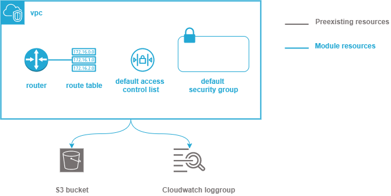

.. image:: docs/imgs/logo.png
   :alt: Logo

======================================
Technogix virtual private cloud module
======================================

About The Project
=================

This project contains all the infrastructure as code (IaC) to deploy a virtual private cloud structure

.. image:: https://badgen.net/github/checks/technogix-terraform/module-aws-vpc
   :target: https://github.com/technogix-terraform/module-aws-vpc/actions/workflows/release.yml
   :alt: Status
.. image:: https://img.shields.io/static/v1?label=license&message=MIT&color=informational
   :target: ./LICENSE
   :alt: License
.. image:: https://badgen.net/github/commits/technogix-terraform/module-aws-vpc/main
   :target: https://github.com/technogix-terraform/robotframework
   :alt: Commits
.. image:: https://badgen.net/github/last-commit/technogix-terraform/module-aws-vpc/main
   :target: https://github.com/technogix-terraform/robotframework
   :alt: Last commit

Built With
----------

.. image:: https://img.shields.io/static/v1?label=terraform&message=1.1.7&color=informational
   :target: https://www.terraform.io/docs/index.html
   :alt: Terraform
.. image:: https://img.shields.io/static/v1?label=terraform%20AWS%20provider&message=4.4.0&color=informational
   :target: https://registry.terraform.io/providers/hashicorp/aws/latest/docs
   :alt: Terraform AWS provider

Getting Started
===============

Prerequisites
-------------

A loggroup and an S3 bucket shall have been created prior to the vpc if logging is enabled for vpc

Configuration
-------------

To use this module in a wider terraform deployment, add the module to a terraform deployment using the following module:

.. code:: terraform

    module "vpc" {

        source      = "git::https://github.com/technogix-terraform/module-aws-vpc?ref=<this module version>"
        project     = the project to which the permission set belongs to be used in naming and tags
        module      = the project module to which the permission set belongs to be used in naming and tags
        email       = the email of the person responsible for the permission set maintainance
        environment = the type of environment to which the permission set contributes (prod, preprod, staging, sandbox, ...) to be used in naming and tags
        git_version = the version of the deployment that uses the permission sets to be used as tag
        cidr        = the cidr range of the network to create
        logging     = { optional object to configure vpc logs management
             s3       = S3 bucket to which logs shall be sent
             loggroup = Cloudwatch loggroup to which logs shall be sent
             role     = Role to use by VPC to senf its log to cloudwatch
       }
    }

Usage
-----

The module is deployed alongside the module other terraform components, using the classic command lines :

.. code:: bash

    terraform init ...
    terraform plan ...
    terraform apply ...

Detailed design
===============

The module creates the vpc. It then overrides the default route table, network access list and security group
to make sure they will be manageable by terraform if needed along the deployment process.

If a logging object has been provided, the network is then configured to send its logs to both a loggroup and an S3 bucket

Testing
=======

Tested With
-----------

.. image:: https://img.shields.io/static/v1?label=technogix_iac_keywords&message=v1.0.0&color=informational
   :target: https://github.com/technogix-terraform/robotframework
   :alt: Technogix iac keywords
.. image:: https://img.shields.io/static/v1?label=python&message=3.10.2&color=informational
   :target: https://www.python.org
   :alt: Python
.. image:: https://img.shields.io/static/v1?label=robotframework&message=4.1.3&color=informational
   :target: http://robotframework.org/
   :alt: Robotframework
.. image:: https://img.shields.io/static/v1?label=boto3&message=1.21.7&color=informational
   :target: https://boto3.amazonaws.com/v1/documentation/api/latest/index.html
   :alt: Boto3

Environment
-----------

Tests can be executed in an environment :

* in which python and terraform has been installed, by executing the script `scripts/robot.sh`_, or

* in which docker is available, by using the `technogix infrastructure image`_ in its latest version, which already contains python and terraform, by executing the script `scripts/test.sh`_

.. _`technogix infrastructure image`: https://github.com/technogix-images/terraform-python-awscli
.. _`scripts/robot.sh`: scripts/robot.sh
.. _`scripts/test.sh`: scripts/test.sh

Strategy
--------

The test strategy consists in terraforming test infrastructures based on the vpc module and check that the resulting AWS infrastructure matches what is expected.
The tests currently contains 2 tests :

1 - A test to check the capability to create an empty vpc

2 - A test to check the capability to create a vpc with logging capability

The tests cases :

* Apply terraform to deploy the test infrastructure

* Use specific keywords to model the expected infrastructure in the boto3 format.

* Use shared EC2 keywords based on boto3 to check that the boto3 input matches the expected infrastructure

NB : It is not possible to completely specify the expected infrastructure, since some of the value returned by boto are not known before apply. The comparaison functions checks that all the specified data keys are present in the output, leaving alone the other undefined keys.

Results
-------

The test results for latest release are here_

.. _here: https://technogix-terraform.github.io/module-aws-vpc/report.html

Issues
======

.. image:: https://img.shields.io/github/issues/technogix-terraform/module-aws-vpc.svg
   :target: https://github.com/technogix-terraform/module-aws-vpc/issues
   :alt: Open issues
.. image:: https://img.shields.io/github/issues-closed/technogix-terraform/module-aws-vpc.svg
   :target: https://github.com/technogix-terraform/module-aws-vpc/issues
   :alt: Closed issues

Roadmap
=======

N.A.

Contributing
============

.. image:: https://contrib.rocks/image?repo=technogix-terraform/module-aws-vpc
   :alt: GitHub Contributors Image

We welcome contributions, do not hesitate to contact us if you want to contribute.

License
=======

This code is under MIT License.

Contact
=======

Nadege LEMPERIERE - nadege.lemperiere@technogix.io

Project Link: `https://github.com/technogix-terraform/module-aws-vpc`_

.. _`https://github.com/technogix-terraform/module-aws-vpc`: https://github.com/technogix-terraform/module-aws-vpc

Acknowledgments
===============

N.A.
